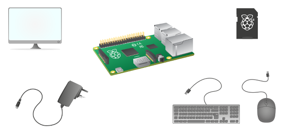
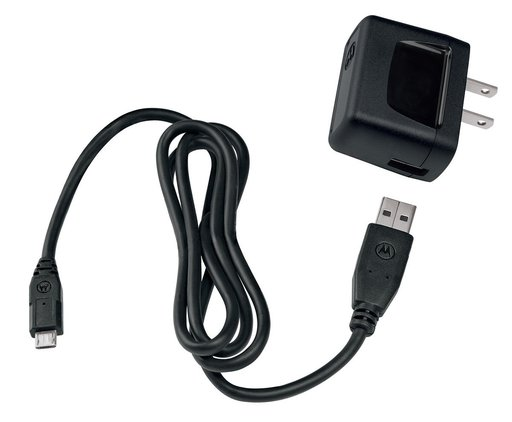
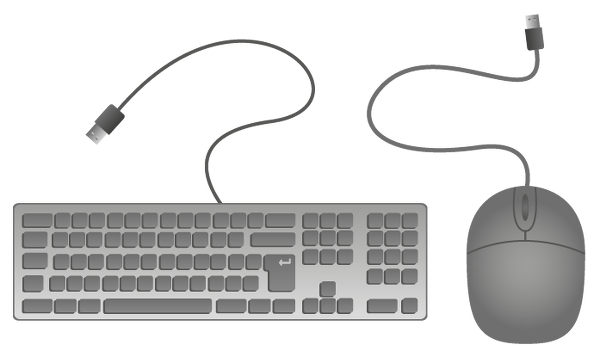

## Check you have the equipment you need

Before you plug anything into your Raspberry Pi, make sure that you have all the equipment you need:

- A monitor with the correct cable and adapter
- A micro USB power supply
- A wired keyboard and mouse, or a wireless keyboard and mouse with a Bluetooth adapter
- A micro SD card
- A Raspberry Pi

To get started with Raspberry Pi, you also need an operating system. If you haven't purchased a pre-installed SD card, details on how to install an operating system onto an SD card can be found in our [software setup guide](https://www.raspberrypi.org/learning/software-guide).

## Monitors

There are several different types of monitor that you can use with the Raspberry Pi:

### HDMI

Most modern television sets and monitors have an HDMI port, and are the easiest to get working with the Raspberry Pi. You can use an HDMI cable to connect the Raspberry Pi directly to the television or monitor.

### DVI

Some older monitors have a DVI port. These work well with the Raspberry Pi, although you'll need an HDMI-to-DVI adapter to attach to an HDMI cable, or a one-piece HDMI-to-DVI cable.

### VGA

Some old monitors have a VGA port. These can be trickier to use as you'll need an HDMI-to-VGA converter, which can change digital video to analogue video. A simple port adapter won't work.

## Power supplies

If you're using a Raspberry Pi 3, then it's recommended that you use a 5V, 2.5A power supply. Earlier models can be powered using a current as low as 1.2A.

### The official Raspberry Pi power supply

Ideally, you want to use a power supply which you know to be safe and which provides ample power to the Raspberry Pi. You can obtain an official Raspberry Pi power supply from [Farnell](http://cpc.farnell.com/stontronics/t5875dv/psu-raspberry-pi-5v-2-5a-multi/dp/SC14025) or [RS](http://uk.rs-online.com/web/p/plug-in-power-supply/9098126/).

### Mobile device charger

Many mobile devices are powered using a 5V micro USB charger. These can often be used to power the Raspberry Pi, although it's worth checking that they provide sufficient voltage and current (5V / 1.2 - 2.5A).

### Micro USB cable connected to another device

There are many devices which are capable of providing power over USB. Some modern wall sockets have USB ports, for instance. You can also connect to USB hubs, computers, and battery packs. If you have a micro USB cable, then you could try to power your Raspberry Pi using any powered USB port.

## Keyboard and mouse

### Wired keyboard and mouse

Any standard USB keyboard and mouse can be used with the Raspberry Pi. These plug and play devices will work without any additional driver. Simply plug them into the Raspberry Pi and they should be recognised when it starts up.

### Bluetooth keyboard and mouse

Bluetooth keyboards and mice can work with the Raspberry Pi, but your success rates will vary depending on the model and manufacturer. It's best to consult the manufacturer's documentation to see whether or not a device is compatible with the Raspberry Pi.

## SD cards

The latest version of Raspbian, the default operating system recommended for the Raspberry Pi, requires an 8GB (or larger) micro SD card. Not all SD cards are made equal, and some have higher failure rates than others. If you're unsure, you can always buy our official SD cards from [RS](http://uk.rs-online.com/web/p/secure-digital-cards/9176317/) or [Farnell](http://cpc.farnell.com/transcend/tsraspi10-16g/memory-microsd-16gb-noobs/dp/SC14027). Any 8GB SD card will work, although you'll need to follow the [software setup guide](https://www.raspberrypi.org/learning/software-guide) to learn how to load an operating system onto the card.

## What next?
- Now that you've checked you have all the right equipment to work with your Raspberry Pi, it's time to plug them all together. Follow the steps in the [quickstart hardware guide](quickstart.md).
