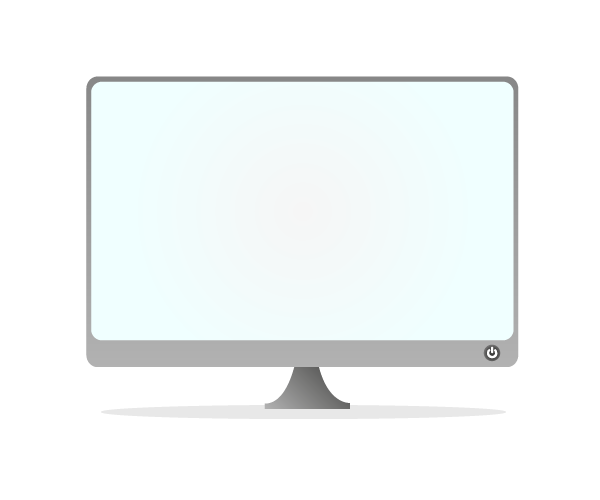
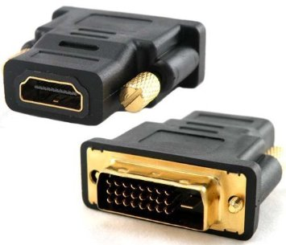
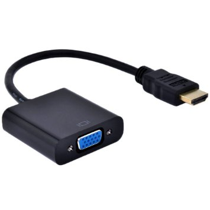
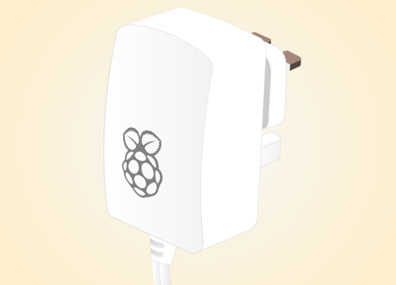
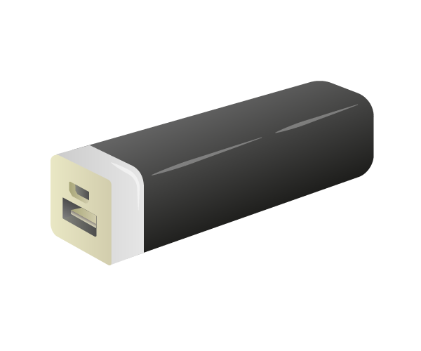
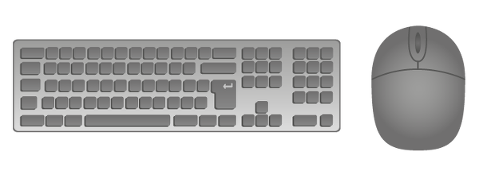

# Raspberry Pi Hardware Setup

## Check you have the equipment you need

Before you plug anything into your Raspberry Pi, make sure that you have all the equipment you need:

- A monitor with the correct cable and adaptor.
- A micro-USB Power Supply
- A wired keyboard and mouse, or a wireless keyboard and mouse with a Bluetooth adaptor
- A micro SD card
- A Raspberry Pi

To get started with Raspberry Pi, you also need an operating system. If you haven't purchased a pre-installed SD card, then details on how to install an operating to an SD card, follow the [software setup guide](https://www.raspberrypi.org/learning/help-software-guide). 

## Monitors

There are several different types of monitor that you can use with the Raspberry Pi:

### HDMI
Most modern television sets and monitors have an HDMI port, and are the easiest to get working with the Raspberry Pi. You can use an HDMI cable to connect the Raspberry Pi directly to the television or monitor.

### DVI
Some older monitors have a DVI port. These work well with the Raspberry Pi, although you will need an HDMI to DVI adaptor to attach to an HDMI cable, or a one-piece HDMI to DVI cable.

### VGA
Some old monitors have a VGA port. These can be trickier to use as you need an HDMI to VGA converter, that can change a digital video to analogue video. A simple port adaptor will not work.

## Power Supplies

If you are using a Raspberry Pi 3, then it is recommended that you use a 5V, 2.5A power supply. Earlier models can be powered using with a current as little as 1.2 A

### The Official Raspberry Pi Power Supply
Ideally you want to use a power supply that you know to be safe and provide ample power to the Raspberry Pi. You can obtain an official Raspberry Pi power supply [here](http://cpc.farnell.com/stontronics/t5875dv/psu-raspberry-pi-5v-2-5a-multi/dp/SC14025) and [here](http://uk.rs-online.com/web/p/plug-in-power-supply/9098126/).

### Mobile device charger
Many mobile devices are powered using a 5V micro-USB charger. These can often be used to power the Raspberry Pi, although it is worth checking that they provide sufficient voltage and current (5V / 1.2 - 2.5A)

### Micro-USB cable connected to ?
There are any devices that are capable of providing power over USB. Many modern wall outlets have USB ports for instance, as well as USB Hubs, Computers and battery packs. If you have a micro-USB cable, then you could try to power your Raspberry Pi off of any powered USB port.

## Keyboard and Mouse

### Wired Keyboard and Mouse
Any standard USB Keyboard and Mouse can be used with the Raspberry Pi. These plug and play devices will work without any additional set up, simply plug them into the Raspberry Pi and they should be recognised when it starts up.

### Bluetooth Keyboard and Mouse

Bluetooth Keyboards and Mice can work with the Raspberry Pi, but you success rates will vary depending on the model and manufacturer. It is best that you consult the manufacturers documentation to see whether a device is compatible with the Raspberry Pi.

## SD Cards

The latest version of Raspbian (the default operating system recommended for the Raspberry Pi) requires an 8GB (or larger) micro-SD Card. Not all SD cards are made equal, and some have higher failure rates than others. You can always buy our official SD cards, if you are unsure, from [here](http://uk.rs-online.com/web/p/secure-digital-cards/9176317/) and [here](https://cpc.farnell.com/sandisk/sdsdqu-008g-bmut/microsd-card-8gb-class-10-noobs/dp/SC13797?COM=main-search%20CMPNULL). Any 8GB SD card will work however, although you will need to follow the [software setup guide](https://www.raspberrypi.org/learning/help-software-guide) to learn how to load an operating system onto the card.

## Plugging in your Raspberry Pi

1. Begin by slotting your SD card into the SD card slot on the Raspberry Pi. It will only fit one way.
1. Next, plug in your USB keyboard and mouse into the USB ports on the Raspberry Pi.
1. Make sure that your monitor or TV is turned on, and that you have selected the right input (e.g. HDMI 1, DVI, etc).
1. Connect your HDMI cable from your Raspberry Pi to your monitor or TV.
1. If you intend to connect your Raspberry Pi to the internet, plug an Ethernet cable into the Ethernet port, or connect a WiFi dongle to one of the USB ports (unless you have a Raspberry Pi 3)
1. When you are happy that you have plugged all the cables and SD card in correctly, connect the micro USB power supply. This action will turn on and boot your Raspberry Pi.

  

