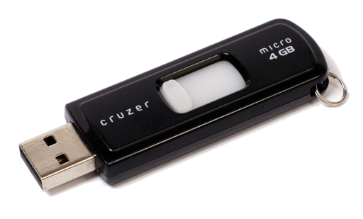

# Adding storage to your Raspberry Pi

You might find that the 8GB SD card you're using with your Raspberry Pi just isn't large enough for your needs. There are several options for increasing the storage capacity of your Raspberry Pi.

## A bigger SD card

Micro SD cards come in a variety of sizes. The largest (reasonably priced) micro SD cards are 128GB, which should provide you with ample storage. As always, check the manufacturer's documentation to ensure that the card is compatible with a Raspberry Pi.

## USB flash drives

There are lots of different types of storage device which you can plug directly into your Raspberry Pi's USB ports to act as secondary storage. USB flash drives come in a variety of styles and sizes, and can offer up to about 1TB of space if you need that much.

## External hard drives

 You can also purchase external hard drives which can be connected via USB cable to transfer data. You have to be a little careful here. Some external hard drives are independently powered, and will work without problems. Some draw their power via the USB port, and might need more current that the Raspberry Pi can supply. Read the manufacturer's documentation to ensure any hard drive you're using will work with the Raspberry Pi. Some external hard drives have been designed specifically to work with the Raspberry Pi, such as the [WD PiDrive 314GB](http://wdlabs.wd.com/products/wd-pidrive-314gb/).

## What next?
- Learn how to [connect your Raspberry Pi to the internet](networking.md)
- Learn how to [add extra storage to save your files](storage.md)
- Find out how you can [connect headphones or speakers for audio output](audio.md)
